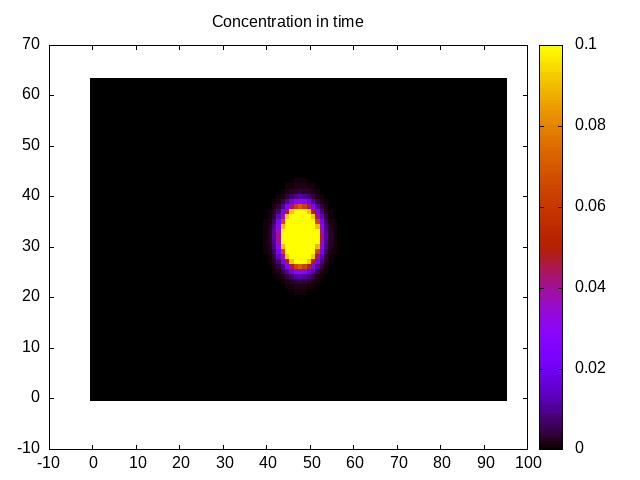

# Fast Fourier Transforms
This program aims to solve the diffusione equation

$$
\frac{\partial c(\mathbf{r}, t)}{\partial t}=\nabla\cdot[D(\mathbf{r})\nabla c(\mathbf{r}, t)]
$$

where $c(\mathbf{r}, t)$ concentration in $\mathbb{R}^3\times \mathbb{R}$ and $D(\mathbf{r})$ diffusion coefficent in $\mathbb{R}^3$, using the Fourier transform of it.

Recall that given a function $f(x)\in L^1(\mathbb{C})$ it Fourier transform $F(q)$ can be defined as:

$$
F(q)=\int_{-\infty}^{+\infty}e^{iqx}f(x)dx
$$

and it inverse as:

$$
f(x)=\frac{1}{2\pi}\int_{-\infty}^{+\infty}e^{iqx}F(q)dq.
$$

Therefore, taking the transform of the $f(x)$ differential w. r. t. $x$ yields:

$$
\begin{aligned}
\frac{d}{dx}f(x)&=\frac{1}{2\pi}\frac{d}{dx}\int_{-\infty}^{+\infty}e^{iqx}F(q)dq \\
&=\frac{1}{2\pi}\int_{-\infty}^{+\infty}e^{iqx}(iq)F(q)dq.
\end{aligned}
$$

i. e., the differential operator

$$
\frac{d}{dx}[\cdot]
$$

in the direct space can be associated to the $iq[\cdot]$ operator in the reciprocal space. We make use of this property.

**Dependencies**
- [**mpi compliant library**](https://www.open-mpi.org/)
- [**FFTW library**](http://www.fftw.org/)
- [**gnuplot**](http://www.gnuplot.info/)

## Compilation
Use:

```make [mode]```

with `[mode]`:
- left blank to compile an 'homemade' version (that is, a version which exploits only locally the FFTW functions and handles explicitly the communication between processes) of the parallel FFTW3 MPI routine to execute a FFT on a 3D grid, will produce *./diffusion.x* executable
- `fftw3_mpi` to compile the FFTW3 MPI routine which runs on a 3D grid, will produce *./diffusion_fftw3_mpi.x* executable

## Execution
Use:
```
make run [iters=%d] [nx=%d] [ny=%d] [nz=%d] [dt=%d] [prc=%d]
```
to run the 'homemade' version, requires `diffusion.x` to be present. 

Use:
```
make fftw3_mpi_run [iters=%d] [nx=%d] [ny=%d] [nz=%d] [dt=%d] [prc=%d]
```
to run the library version, requires `diffusion_fftw3_mpi.x` to be present. 

Where:
- `nx`, `ny` and `nz` dimensions of the grid
- `iters` number of iterations
- `dt` dimension of the single iteration time step
- `prc` number of processes

## Other
Use:
- `make clean` to clean up
- `make [mode] flag=debug` to compile an executable which produces useful information during the execution, where `[mode]` can be left black or be `fftw3_mpi`
- `make plot` to plot pretty things after the execution (you have to compile with `flag=debug` and then run for this to work)



